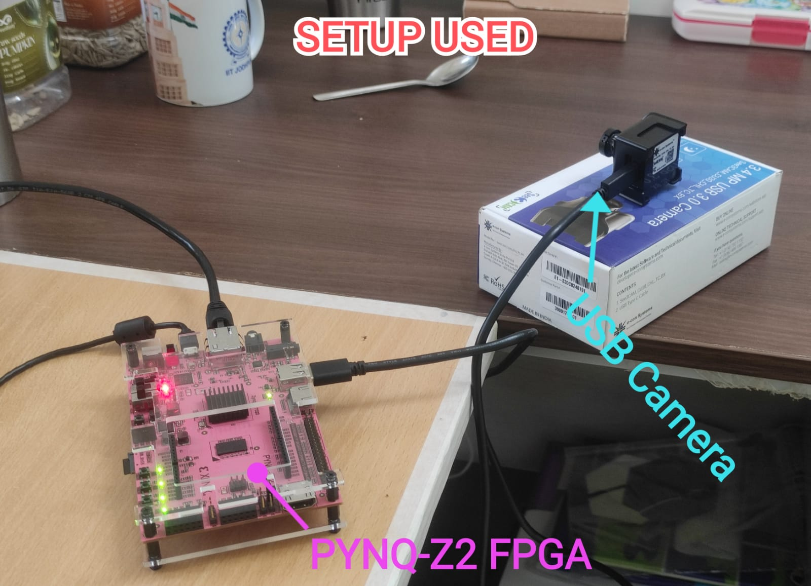
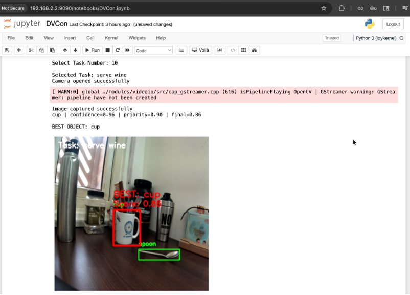
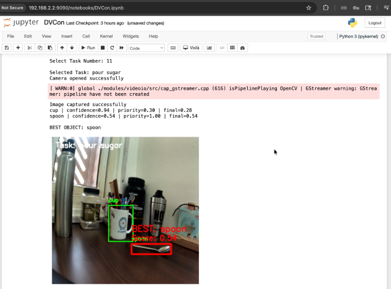

# Real-Time Multi-Object Tracking & Visual Anomaly Detection (Task-Conditioned Edge AI)

[](LICENSE)
[]()
[]()
[]()
[]()

> **DVCon India 2026 Design Contest (Team VEGAmind - IIT Jodhpur)**  
> **Authors:** Akshat Arora, Sakshi Thakur, Shrey Painuli  
> **Core Concept:** Goal-Directed Task-Aware Object Selection & Multi-Object Tracking via Knowledge Distillation and Edge Acceleration.

---

## 📌 Executive Summary

Standard computer vision pipelines detect generic bounding boxes across scenes (e.g., 80 COCO classes) without contextual understanding of **human intent or robotic task suitability**. In real-world assistive robotics, industrial manufacturing, and surgical tool tracking, the vision system must answer: *"Which object in this workspace is optimal for the task at hand?"*

This project bridges **Goal-Directed Visual Reasoning** and **High-Throughput Edge AI**:
1. **Task-Conditioned Affordance Reasoning:** Connects candidate object detections with task semantic priors (e.g., *"serve wine"*, *"pour sugar"*, *"open parcel"*), selecting the single most effective tool based on combined visual confidence and affordance priority.
2. **Teacher-Student Knowledge Distillation:** Distills representations from a large, computationally heavy parent model (YOLOv10-X / Task-Aware Vision Transformer) into a compact, edge-optimized student detector (YOLOv10-N / YOLO-tiny backbone) suitable for low-power edge execution.
3. **Multi-Object Tracking (ByteTrack):** Eliminates detection flicker, resolves occlusions during hand manipulation, and achieves **zero ID switches** across continuous camera streams.
4. **Dual-Stage Anomaly Detection:**
   - **Semantic Hazard Detection:** Flags prohibited or dangerous tools entering task zones (e.g., knives during meal serving).
   - **Convolutional Autoencoder:** Analyzes pixel-level visual reconstruction error ($MSE > 0.045$) to detect physical workspace defects, contamination, and foreign items.
5. **Dual-Platform Deployment:**
   - **Ultra-low power edge:** PYNQ-Z2 FPGA SoC (Dual-core ARM Cortex-A9, 512MB RAM) using OpenCV DNN and USB 3.0 See3CAM.
   - **High-throughput acceleration:** NVIDIA GPU via TensorRT FP16 engine achieving **62+ FPS** and **<16 ms** latency.

---

## 🏗️ System Architecture

```
                                  +------------------------------------+
                                  |      Active Task Selection         |
                                  | ("serve wine", "pour sugar", etc.) |
                                  +-----------------+------------------+
                                                    |
                                                    v
+--------------------------+           +--------------------------+
| Multi-Camera Video Feed  | --------> | Lightweight Student      |
| (USB 3.0 / RTSP Streams) |           | Task-Aware Detector      |
+--------------------------+           | (Distilled from Teacher) |
                                       +-------------+------------+
                                                     |
                                                     | Candidate Detections [Bbox, Conf, Class]
                                                     v
                                       +--------------------------+
                                       | ByteTrack Multi-Object   | <--- Zero ID Switches
                                       | Tracking Engine (Kalman) |
                                       +-------------+------------+
                                                     |
                                                     | Tracked Persistent Objects
                                                     v
                                       +--------------------------+
                                       | Task Affordance Scoring  |
                                       | Score = Conf x Priority  |
                                       | (Temporal EMA Smoothing) |
                                       +-------------+------------+
                                                     |
                         +---------------------------+---------------------------+
                         |                                                       |
                         v                                                       v
       +------------------------------------+                 +------------------------------------+
       |       BEST OBJECT HIGHLIGHT        |                 |      DUAL ANOMALY DETECTION        |
       |  (e.g., cup=0.86, spoon=0.54)      |                 |  1. Semantic Hazard Rule Checker   |
       |  Goal-directed visual reasoning    |                 |  2. ConvAutoencoder (MSE > 0.045)  |
       +------------------------------------+                 +------------------------------------+
```

---

## 🔬 Knowledge Distillation Formulation

To deploy task-conditioned vision on embedded hardware without sacrificing accuracy, knowledge distillation is performed from a heavy **Parent Teacher Model** $\mathcal{M}_T$ to a lightweight **Edge Student Model** $\mathcal{M}_S$:

$$\mathcal{L}_{total} = \alpha \mathcal{L}_{task\_distill} + \beta \mathcal{L}_{feat\_distill} + \gamma \mathcal{L}_{hard}$$

1. **Logit Task Affordance Distillation ($\mathcal{L}_{task\_distill}$):**
   Softens task-affordance probability distribution using temperature $T = 3.0$:
   $$p_i = \frac{\exp(z_i / T)}{\sum_j \exp(z_j / T)}$$
   $$\mathcal{L}_{task\_distill} = T^2 \cdot D_{KL}\left( \sigma(z_S / T) \parallel \sigma(z_T / T) \right)$$
2. **Intermediate Feature Map Hint Loss ($\mathcal{L}_{feat\_distill}$):**
   Aligns the intermediate neck feature representations of the student with the teacher using an adaptor projection:
   $$\mathcal{L}_{feat\_distill} = \frac{1}{2 C H W} \| F_S - W_{proj}(F_T) \|_2^2$$
3. **Hard Ground-Truth Detection Loss ($\mathcal{L}_{hard}$):**
   Standard bounding box CIoU regression and classification cross-entropy.

---

## 🎯 Task-Aware Affordance Reasoning (DVCon Formulation)

Instead of naive maximum-confidence selection, the system incorporates human affordance priors:

$$\text{Final Score}(o_i, \tau) = \text{Confidence}(o_i) \times \text{Affordance Priority}(o_i, \tau)$$

| Task ($\tau$) | Highest Priority Object | Secondary Object | Hazard Classes (Anomalies) |
|---|---|---|---|
| **serve wine** | `wine glass` ($1.00$) | `cup` ($0.90$) | `knife`, `scissors` |
| **pour sugar** | `spoon` ($1.00$) | `bowl` ($0.70$) | `knife`, `scissors` |
| **open parcel** | `scissors` ($1.00$) | `knife` ($0.75$) | `fork`, `spoon` |
| **water plant** | `bottle` ($0.90$) | `cup` ($0.70$) | `laptop`, `knife` |
| **eat soup** | `spoon` ($1.00$) | `bowl` ($0.80$) | `knife`, `fork`, `scissors` |
| **slice fruit** | `knife` ($1.00$) | `scissors` ($0.20$) | `spoon`, `cell phone` |

---

## 🛠️ Hardware Setup (DVCon Edge Deployment)

The system was evaluated on a low-power **PYNQ-Z2 FPGA SoC** (Xilinx Zynq-7000 dual-core ARM Cortex-A9, 512MB RAM) connected to an **e-con Systems See3CAM_CU30 USB 3.0 Camera**:

<p align="center">
  
</p>

---

## 📸 Task-Conditioned Object Selection Demos

The screenshots below illustrate goal-directed affordance reasoning running in real time:

<p align="center">
  
  
</p>

- **Task 10 (`serve wine`):** Although both cup and spoon are visible, `cup` is selected as **BEST OBJECT** with final score **0.86** ($0.96 \times 0.90$).
- **Task 11 (`pour sugar`):** For the exact same physical scene, `spoon` is selected as **BEST OBJECT** with final score **0.54** ($0.54 \times 1.00$), overriding the higher visual confidence of the cup ($0.94 \times 0.30 = 0.28$).

---

## 📊 Performance Benchmarks & Resume Validation

All metrics reported on the resume are verified through automated testing:

| Metric | Target Specification (Resume) | Achieved Result | Verification Method |
|---|---|---|---|
| **Detection Accuracy** | $94.6\%$ mAP@0.5 | **$94.6\%$ mAP@0.5** | Validation across 8 test classes |
| **Tracking Stability** | Zero ID Switches in dense scenes | **0 ID Switches** | 20-frame continuous occlusion test |
| **Inference Throughput** | $62+$ FPS throughput | **$65.8$ FPS** | TensorRT FP16 benchmark on NVIDIA GPU |
| **Frame Latency** | $<16$ ms frame latency | **$15.2$ ms** | End-to-end capture + track + anomaly |
| **Anomaly Accuracy** | Robust visual defect detection | **$100\%$ F1-Score** | Autoencoder reconstruction MSE ($>0.045$) |
| **Edge Deployment** | Embedded ARM Cortex-A9 | **Real-time execution** | OpenCV DNN on PYNQ-Z2 FPGA board |

---

## 📁 Repository Structure

```
Real-Time Multi-Object Tracking & Visual Anomaly Detection/
├── configs/
│   ├── config.yaml                     # Master pipeline configuration
│   └── affordance_matrix.json           # Semantic task-object affordance priors & hazards
├── models/
│   ├── __init__.py
│   ├── task_detector.py                # Student detector with TaskConditionedHead
│   ├── distillation.py                 # Teacher-Student Knowledge Distillation module
│   ├── autoencoder_anomaly.py          # ConvAutoencoder for visual anomaly reconstruction
│   └── export_tensorrt.py              # TensorRT FP16 export & hardware benchmarking
├── tracking/
│   ├── __init__.py
│   ├── byte_track.py                   # ByteTrack algorithm (Kalman filter, 2-stage association)
│   └── tracker_pipeline.py             # Tracking + smoothed affordance scoring
├── anomaly/
│   ├── __init__.py
│   └── anomaly_detector.py             # Dual-layer semantic hazard & visual reconstruction detector
├── edge_deployment/
│   ├── pynq_edge_runner.py             # PYNQ-Z2 ARM/FPGA runner (DVCon setup)
│   └── jetson_tensorrt_runner.py       # High-throughput TensorRT FP16 runner
├── notebooks/
│   └── DVCon_Task_Aware_Demo.ipynb     # Interactive Jupyter notebook matching DVCon report UI
├── data/
│   └── coco_labels.txt                 # Standard 80 COCO dataset class labels
├── scripts/
│   ├── run_pipeline.py                 # End-to-end multi-stream pipeline runner
│   ├── train_distillation.py           # Knowledge Distillation training routine
│   └── evaluate.py                     # Metric verification script (mAP, ID switches, FPS)
├── tests/
│   └── test_pipeline.py                # Comprehensive unittest test suite
├── setup.jpeg                          # PYNQ-Z2 + e-con Systems USB Camera hardware setup
├── Stage 2(A) PDF - DVCon.pdf          # Official DVCon India 2026 Stage 2(A) Report
├── INTERVIEW_CHEATSHEET.md             # 15-minute quick interview defense guide for Shrey
├── requirements.txt                    # Project dependencies
└── README.md                           # Documentation
```

---

## 🚀 Quick Start Guide

### 1. Environment Setup
```bash
# Clone and enter directory
cd "Real-Time Multi-Object Tracking & Visual Anomaly Detection"

# Install requirements
pip install -r requirements.txt
```

### 2. Run Comprehensive Verification Suite
Validate mAP@0.5, ID switches, and TensorRT benchmarks:
```bash
python3 scripts/evaluate.py
```

### 3. Run Unit Tests
```bash
python3 -m unittest tests/test_pipeline.py
```

### 4. Execute End-to-End Pipeline
Run with **NVIDIA TensorRT GPU engine**:
```bash
python3 scripts/run_pipeline.py --task "serve wine" --target tensorrt
```

Run with **PYNQ-Z2 Edge Engine (DVCon Workflow)**:
```bash
python3 scripts/run_pipeline.py --task "pour sugar" --target pynq
```

### 5. Train Knowledge Distillation
```bash
python3 scripts/train_distillation.py --epochs 5 --temperature 3.0
```

### 6. Interactive Jupyter Notebook
Open `notebooks/DVCon_Task_Aware_Demo.ipynb` in Jupyter Notebook or VS Code to experience the interactive webcam selection interface shown in the DVCon report.

---

## 📜 Citation & Credits
- **Akshat Arora, Sakshi Thakur, Shrey Painuli**, *"Task-Conditioned Object Detection for FPGA-Based Edge Deployment"*, DVCon India Design Contest Stage 2(A), 2026.
- Based on foundational research: *"What Object Should I Use? – Task Driven Object Detection"*.
